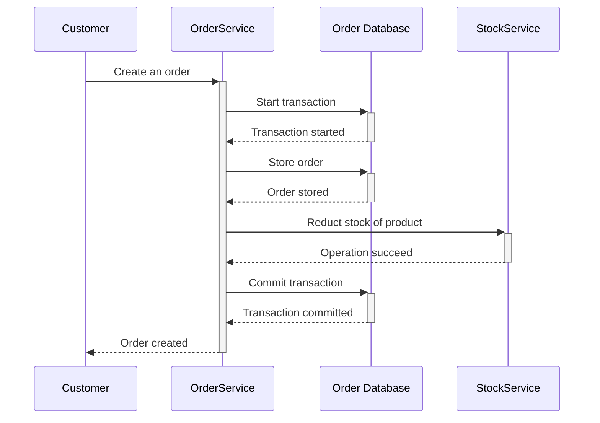
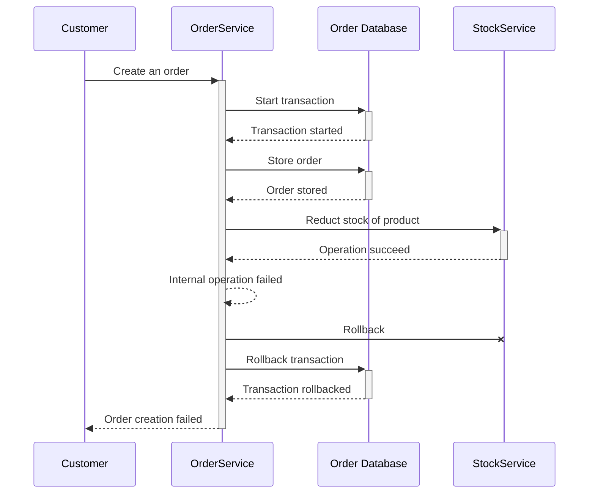

A **distributed transaction** is a [database transaction](https://en.wikipedia.org/wiki/Database_transaction) in which two or more network hosts are involved.  

As we know, network and hosts may unreachable due to some reasons, like power failure, hardware malfunction, etc. 

In this article, I'll share how to implement distributed transaction with TCC.

<!--more-->

## Problem

Imaging you are developing an e-commercial application. Typically, there are many services, including OrderService, StockService, ProductService. If customer buys some product and create an order, we need to create an order and reduct the stock of these products.

The following sequence diagram shows that if everything goes ok, it will create an order and ACID is ensured.

If database or downstream service fails, we can do a simple rollback to database and OrderService, that seems good. But network and hosts maybe unreachable, our rollback maybe lost. So what will happen? Nobody knows, maybe there is no order created, but stock still reduced, this is a terrible thing!

The following sequence diagram shows the transaction rollback but the stock reduced, which causes a inconsistency and breaks ACID. 

## Solution

TCC represents Try-Confirm-Cancel, any resource in distributed transaction should provide three stage:

+ Try: Try to allocate resource for future use
+ Confirm: All operation at stage **Try** are succeed, commit the distributed transaction
+ Cancel: Something wrong, rollback

Take the e-commerce order just now as an example, the following sequence diagram shows the whole process in TCC.

```mermaid
sequenceDiagram
Customer->>+OrderService: Create an order
OrderService->>+Order Database: Try: Store order<EXECUTING>
Order Database-->>-OrderService: Order stored
alt Successful path
OrderService->>+StockService: Try: Reserve some stock
StockService-->>-OrderService: Stock reserved
OrderService->>+StockService: Confirm: Mark stock reduced
StockService-->>-OrderService: Stock reduced
OrderService->>+Order Database: Confirm: Modify order status<SUCCEED>
Order Database-->>-OrderService: Order modified
else Failure path
OrderService->>+StockService: Try: Reserve some stock
StockService-->>-OrderService: Stock reserved
OrderService-xStockService: Confirm: Mark stock reduced
OrderService->>+StockService: Cancel: Restore stock
StockService-->>-OrderService: Stock restored
OrderService->>+Order Database: Cancel: Modify order status<FAILED>
Order Database-->>-OrderService: Order modified
end
OrderService-->>-Customer: Order created or failed
```

If everything goes ok, our Try-Confirm will execute successfully, database is consistent, if something fails, our Try-Cancel will handle this situation, database is also consisten. But as mentioned above, network and hosts maybe unreachable, so our commit or rollback will lost.

### General Problems

I'll show some general problems and associated solution with TCC.

1. Order creation with EXECUTING state fails

   Local transaction will rollback, make sense!

2. Call StockService to reverse some stocks fails

   Local transaction will rollback, and a rollback also send to StockService, StockService can do rollback or do nothing

3. Call StockService to reverse some stocks successfully, but reply of StockService lost

   This will cause Try to timeout, local transaction will rollback and a following rollback will send to StockService, StockService can do rollback.

To solve some temporary problem, we can do retry. There are two points we need to considerate when do retry.

**Idempotency**

Idempotency means that no matter how many requests are made, the result is the same as the first successful request.

For example, we want to reserve 10 units of a product,  no matter how many times we call Try to StockService, finally only 10 units are reserved.

For every order, we create a unique id as idempotent key, and send to StockService, so if StockService processed current request, it will simply return the previous result.

**Retry delay**

There are many delay strategies:

+ Immediately retry. Once previous request failed, do a retry immediately, this is not a good choice which may cause downstream service overload
+ Fixed rate retry. Retry with a fixed rate like 10ms.
+ Incremental retry. Every retry will increase delay sequentially, for example, sleep 10ms, 20ms, 30ms
+ Expotential backoff retry.  Every retry will increase delay expotentially, for example, sleep 10ms, 20ms, 40ms

### Special Problems

Due to network issue, there are some special problems.

**Empty Rollback**

Try did not execute, but Cancel executed. 

The following steps show how **empty rollback** occurs.

1. Make a Try to downstream (packet lost)
2. Transaction rollback, make a Cancel to downstream
3. Downstream receives Cancel

The Cancel operaiton of downstream will fail because of no cancellable record found, but if we responses fail to upstream, upstream will do a retry which is a useless operation. So in Empty Rollback situation, we need to response success to upstream and downstream service do nothing to avoid network and compute resource waste.

**Hanging transaction**

Handing transaction means because of network issues, Cancel is executed before Try, if not handled properly, may result in inconsistencies.

The following steps show how **Haning transaction** occurs.

1. Make a Try to downstream(congested network)
2. Transaction rollback due to timeout of Try, make a Cancel to downstream
3. Downstream receives Cancel, do nothing but respond success
4. Downstream receives Congested Try, reserve resource

To solve this problem, downstream service need to record that current transaction was handled(by record transactionId) before reply Cancel call to upstream. Once Try received, check whether the current transaction has been handled. 

## Wrap Up

TCC is a good solution to implement distributed transaction in which there also are some problems. Idempotency and proper Retry make TCC better.

## Reference

- [1] [Distributed transaction](https://en.wikipedia.org/wiki/Distributed_transaction)

