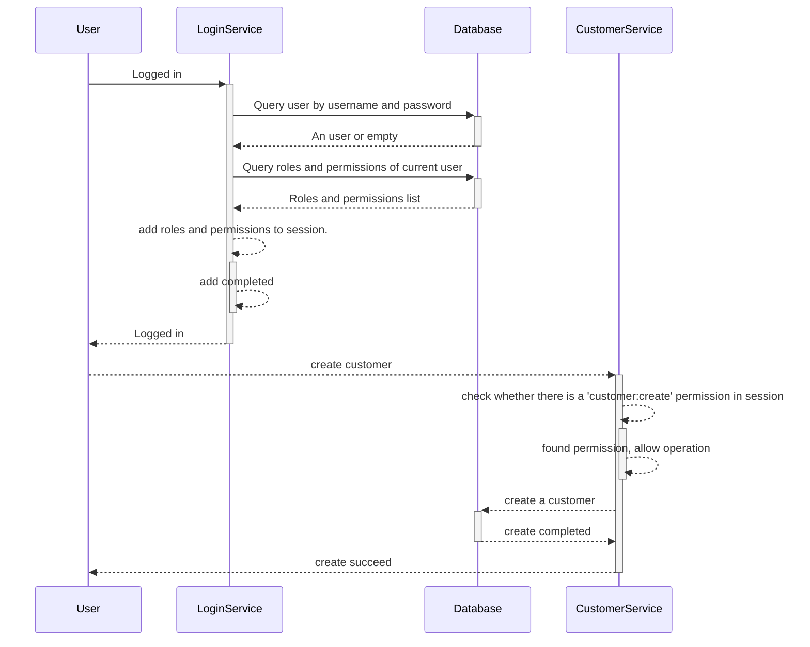

>  [Role-based access control(RBAC)](https://en.wikipedia.org/wiki/Role-based_access_control) is a policy-neutral access control mechanism defined around **roles** and **privileges**. The components of RBAC such as **role-permissions**, **user-role** and role-role relationships make it simple to perform user assignments. 

In this article, I'll share some information about RBAC.
<!--more-->
The basic idea of RBAC is to separate permission management from users to reduce management complexity and provider higher flexibility and security. By using roles as a middle layer, administrators can more easily manage user permissions without having to focus on each user's permission settings.

## Terminology

There are 3 terminologies in RBAC:

+ Role
+ Permisson
+ User

**Role**

+ Role is an abstract concept to define a set of related permission. For example, there are some roles in one system: administrator, normal user, guest, each role has a related permissions.
+ Roles gives users corresponding access rights by assigning permissions to them.
+ In some implementation, Roles can form hierachies to provider higher flexibility.

**Permission**

Permission is an ability to perform specific action or access specific resource.

+ Permission describes a requirement to access resource or action in a system.
+ There are 2 ways to define permission: allow and deny. Allow permission allows user to access a resource or perform an action, it likes a whitelist; Deny permission denied user to access a resource or perform an action, it likes a blacklist.

**User**

An user is an identity in a system, which could be assigned different roles to grant different permissions.

## Implementation

It's simple to implement a RBAC in a system. In the following content, I'll provider a simple implementation.

**Table Definitation**

**Role**

| column name | column type  | column description              |
| ----------- | ------------ | ------------------------------- |
| id          | int          | Role id                         |
| name        | varchar(40)  | role name                       |
| description | varchar(128) | A brief description of the role |
| enabled     | boolean      | whether the role is enabled     |
| created_at  | datetime     | when the role is created        |

**Permission**

| column name | column type  | column description                    |
| ----------- | ------------ | ------------------------------------- |
| id          | int          | permission id                         |
| name        | varchar(40)  | permission name                       |
| description | varchar(128) | A brief description of the permission |
| created_at  | datetime     | when the permission is created        |

**Role-Permission**

An table represents what permissions the specific role has.

| column name   | column type | column description |
| ------------- | ----------- | ------------------ |
| role_id       | int         | Role id            |
| permission_id | int         | permission id      |

**User**

User represents an identity who has the access to log in this system.

| column name | column type  | column description       |
| ----------- | ------------ | ------------------------ |
| id          | int          | user id                  |
| username    | varchar(20)  | -                        |
| password    | varchar(255) | A hashed password        |
| name        | varchar(20)  | -                        |
| created_at  | datetime     | when the user is created |

**User Role**

An table represents what roles the specific user has.

| column name | column type | column description |
| ----------- | ----------- | ------------------ |
| user_id     | int         |                    |
| role_id     | Int         |                    |

**Example Data**

Imaging you are designing a RBAC in a CRM system.

**User**

| id   | username | password | name     | created_at          |
| ---- | -------- | -------- | -------- | ------------------- |
| 1    | staff1   | -        | staff1   | 2023-01-01 10:00:00 |
| 2    | manager1 | -        | manager1 | 2023-01-01 10:00:00 |

**Role**

| id   | name     | description | enabled | created_at          |
| ---- | -------- | ----------- | ------- | ------------------- |
| 1    | salesman | -           | true    | 2023-01-01 10:00:00 |
| 2    | manager  | -           | true    | 2023-01-01 10:00:00 |

**Permission**

| id   | name            | description | created_at          |
| ---- | --------------- | ----------- | ------------------- |
| 1    | customer:create | -           | 2023-01-01 10:00:00 |
| 2    | customer:update | -           | 2023-01-01 10:00:00 |
| 3    | customer:delete | -           | 2023-01-01 10:00:00 |
| 4    | customer:view   | -           | 2023-01-01 10:00:00 |

**Role-Permission**

The following data shows the salesman allows create/update/view a customer and the manager has the full access.

| role_id | permission_id |
| ------- | ------------- |
| 1       | 1             |
| 1       | 2             |
| 1       | 4             |
| 2       | 1             |
| 2       | 2             |
| 2       | 3             |
| 2       | 4             |

**User-Role**

| user_id | role_id |
| ------- | ------- |
| 1       | 1       |
| 2       | 2       |

**Sequence diagram**

The following diagram shows an example of an user logged in and create a customer.

## Conclusion
Role-based access control (RBAC) has important application value in the field of access control. By associating permissions with roles, RBAC implements a structured access control management method. The implementation of RBAC can improve management efficiency and enhance system security.

## References

+ [1] [Role-based access control](https://en.wikipedia.org/wiki/Role-based_access_control) -- WikiPedia 
