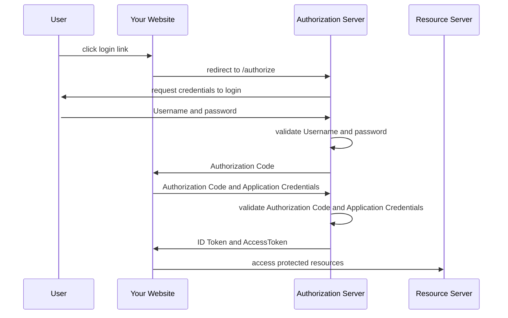
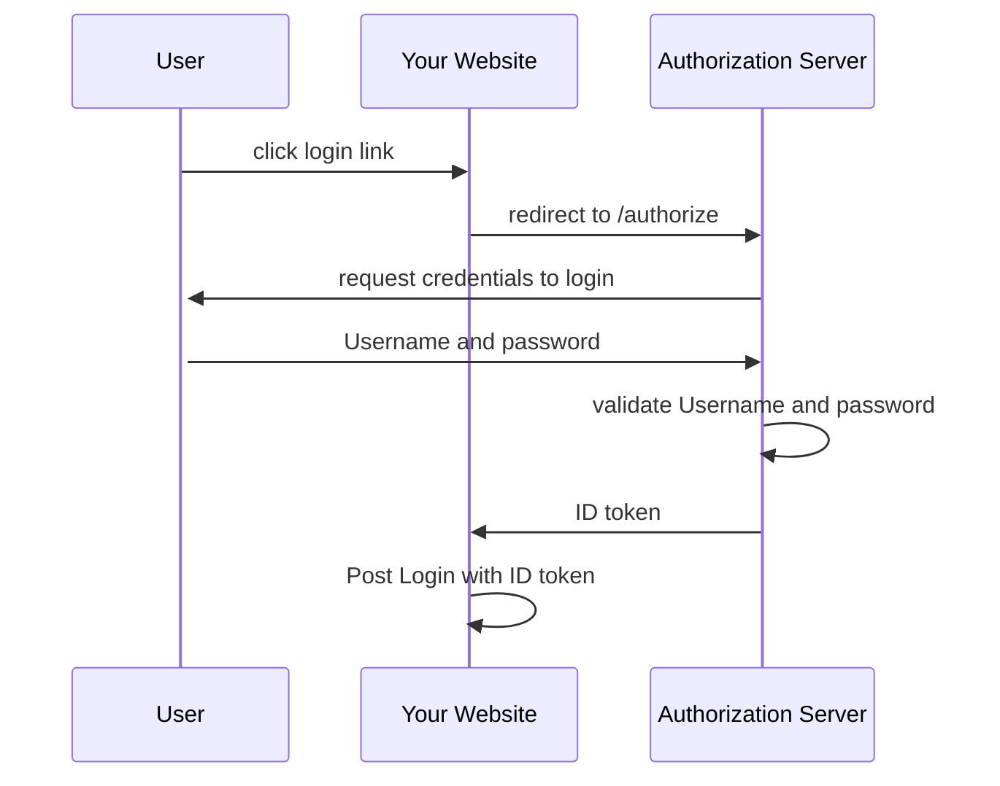
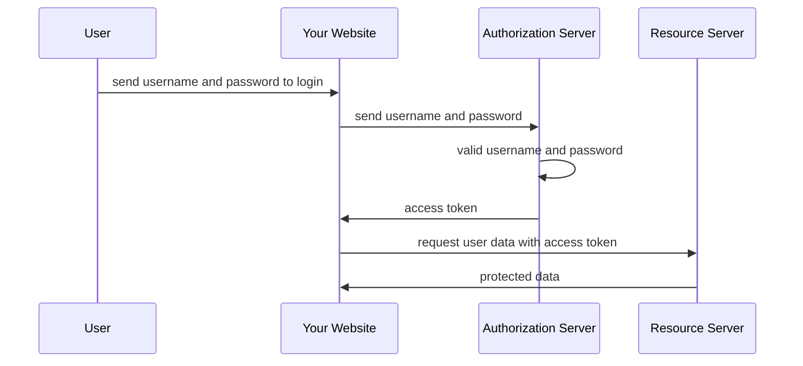
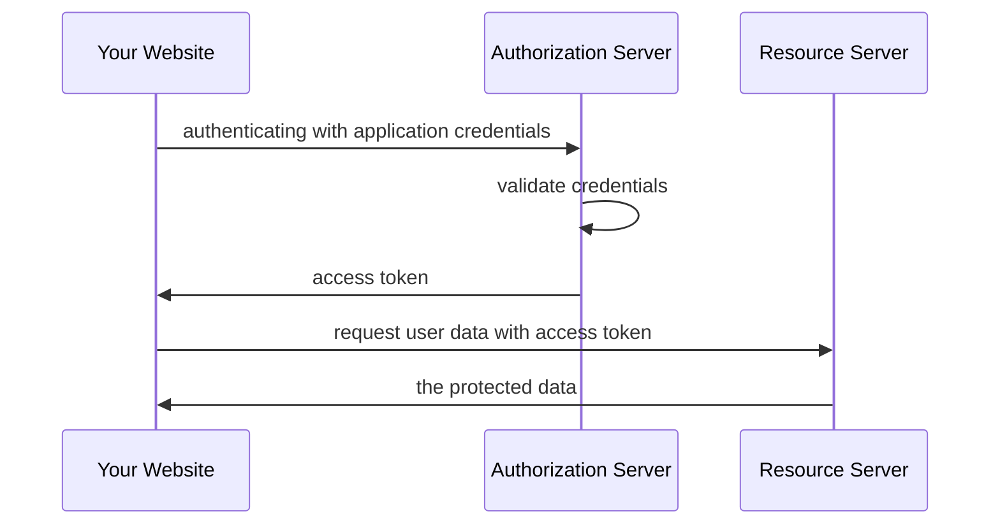

OAuth is an authorization approache that simplifies the authorization processes for applications. Manyones may know about Authorization Code Flow, but there are still other approaches. In this article, we'll learn how it works, covering authorization types, principles and notes.

<!--more-->

The OAuth 2.0 authorization framework operates as a protocol enabling users to grant access to their protected resources for a third-party website or mobile application. This is achieved without the need to disclose their long-term credentials or, in some cases, their identity.

## Roles

There are many roles in Oauth2.0 framework, let's take a look:

+ **Resource Owner**: The entity that possesses the resource and has the ability to grant access to a protected resource, such as an end-user.
+ **Resource Server**: The server that maintains the protected resources. It is necessary to engage with this server to gain access to the protected resources.
+ **Client**: The application that seeks to access a protected resource on behalf of the Resource Owner.
+ **Authorization Server**: The server responsible for authenticating the Resource Owner and for issuing access tokens to receiving valid authorization.

For example, imagine I want to create a web application that interacts with Google OAuth to access a user's nickname, avatar, and email. Here's how the roles are defined:

+ **Resource Owner**: An individual using Google services.
+ **Resource Server**: Google's server, which holds the user's personal information such as their nickname, avatar, and email.
+ **Client**: My web application, designed to redirect users to Google OAuth for the purpose of acquiring an access token.
+ **Authorization Server**: Google's OAuth server, responsible for the secure storage and verification of users' login credentials.

## Grant Types

Oauth2.0 defines four flows to get access token, which are called grant types.

### Authorization Code Flow

The Authorization Code Flow involves exchanging an authorization code for an access token. This is a very common Flow since there are many mobile apps and websites need to authorize user.

Typically, you need to apply for an appid and secret from the Authorization Server, and you need to set a callback URL. After the Authorization Server generates the Authorization Code, it will redirect to your callback URL with the Authorization Code.

1. The user clicks "Login with Your Website or Application."
2. Your website redirects to the Authorization Server for authorization with response_type `authorization_code`.
3. The Authorization Server will ask the user to log in.
4. The user provides his/her username and password to log in to the Authorization Server.
5. The Authorization Server checks whether the username and password are correct.
6. If the username and password are correct, the Authorization Server will generate a random Authorization Code and then redirect to your callback URL with the code.
7. Your website requests the Authorization Server to exchange the user's ID Token and Access Token using the app ID, secret, and the Authorization Code.
8. The Authorization Server will check your code, app ID, and secret; if they are correct, it will return the user's ID Token and Access Token to Your Website.
9. Your website can use this ID Token and Access Token to access protected resources on the Resource Server.

**Some Notes**

1. You should store your app ID and secret in a highly secure environment; otherwise, your users' data may be accessed by unauthorized attackers.
2. You should set a session-based random state in your application before redirecting to the Authorization Server. The Authorization Server will pass this parameter to your website after generating the Authorization Code. You can check this parameter to prevent Cross-Site Request Forgery (CSRF) attacks.

### Implicit Flow with Form Post

If all you want to do is implementing sign-in and you don't need to obtain access tokens for invoking APIs, you can choose Implicit Flow with Form Post. This approach doesn't require a secret to exchange access token, so it can be used by front-end only, secure and effective.

1. The user clicked on "Login."
2. Your website redirects to the Authorization Server with `response_type` set to `id_token`.
3. The user provides his/her username and password to log in to the Authorization Server.
4. The Authorization Server checks whether the username and password are correct.
5. If the username and password are correct, the Authorization Server generates a random ID Token and then redirects to your callback URL with the token.
6. Your website's JavaScript extracts the token from the URL's hash part and sends an HTTP POST request to your server.
7. Your server allows the user to log in.

**Some Notes**

1. Since the ID token is exposured to the client, which can be a web page with client-side Javascript. This makes the token vulnerable to XSS attacks if the page is not properly secured.
2. This approach may be susceptible to Cross-Site Request Forgery(CSRF) attacks because tokens are transmitted via redirects or form posts, which can be triggered by malicious sites if the user is logged into the target service from another browser tab.

### Resource Owner Password Flow

When redirect-based flows(like Authorization Code Flow and Implicit Flow with Form Post), there is a new type, Resource Owner Password Flow.

> In this flow, credentials(like username and password) are sent to the backend server, then the backend server sends the credentials to the Authorization Server to obtain access tokens,  so it is imperative that the application is absolutely trusted with this information.

1. The user inputs their username and password, then clicks "Login."
2. Your website sends the username and password to the Authorization Server.
3. The Authorization Server validates the username and password.
4. The Authorization Server replies with an access token or an error message.
5. Your website obtains an access token and requests user data using that access token from the Resource Server.
6. The Resource Server replies with the protected data.

**Some Notes**

Since your website can access the credentials and can store the credentials for future use before being exchanged for an access token, you need to ensure your website is absolutely credible.

### Client Credentials Flow

The Client Credentials Flow involves an application exchanging its application credentials, such as appid and secret, for an access token. This flow is a machine-to-machine approach, no user participated.

1. Your Website sends request to the Authorization Server with application credentials
2. The Authorization Server validates the credentials
3. If the credentials are correct, the Authorization Server will reply an access token
4. Your Website obtains the access token and request user data with that access token to the Resource Server
5. The Resource Server replies the protected data

**Some Notes**

1. You should keep your appid and secret in a secure environment and use HTTPS to communicate with other servers.

## Conclusion

As we conclude this comprehensive overview of the Oauth2.0 framework and introduces 4 different work flows.

Oauth greatly simplies the authorization process of our applicaton, however, with great power comes great responsibility. The security of OAuth implementations relies heavily on the developers' understanding of its protocols and best practices,  It is crucial to choose the appropriate grant type for each scenario, implement strict transport security measures, and ensure that all tokens are handled with the utmost care to prevent unauthorized access.

In summary, OAuth 2.0 is a powerful tool in the developer's arsenal, facilitating secure and user-friendly resource sharing in our interconnected digital world. By applying the principles and protocols outlined in this article, we can help ensure that OAuth continues to serve as a reliable foundation for authorization and identity management for years to come.
