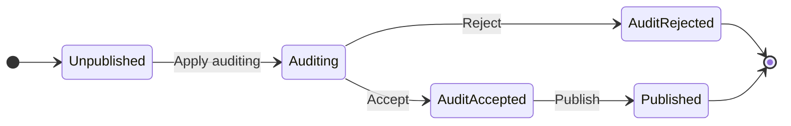

在本文中，我将分享如何构建有限状态机（FSM）来帮助业务流程过渡，例如审计。

> 有限状态机（英语：finite-state machine，缩写：FSM）又称有限状态自动机（英语：finite-state automaton，缩写：FSA），简称状态机，是表示有限个状态以及在这些状态之间的转移和动作等行为的数学计算模型。
> 
> ***维基百科*** - **[有限状态机](https://en.wikipedia.org/wiki/Finite-state_machine)**
<!--more-->

## 背景

想象一下你在一家电子商务公司工作，如果你想发布一个新产品到生产环境，你需要先提交一个**AuditRequest**，然后你的经理会接受或拒绝这个AuditRequest。 如果您的经理接受，您就可以发布您的产品，以便任何人都可以看到。

在这种情况下，产品的状态发生了多次转变，如下图所示。



## 术语定义

+ FromState：实体的当前状态。 在上面的例子中，一开始状态是**未发布**。
+ 事件：转移到下一个状态的事件。 您触发了一个 **应用审核** 事件。
+ ToState：下一个状态。 有**审核**状态。
+ 操作：要执行的操作。 此操作会将产品的状态从 **FromState** 和 **ToState** 更改，并且该操作允许执行更多操作，例如向审核平台发送 HTTP 请求。
+ 转换：一条记录表示从 **FromState** 到 **ToState** 通过 **Event** 和 **Action**。

## 实现

如何实现这个FSM？ 本质上，我们可以将其视为一个有向循环图，每个Node是一个状态，每条边是一个事件。 所以我们可以使用一些图的数据结构和算法来实现这一点。

实施步骤如下：

1. 配置状态机，通常我们可以从数据库查询所有的状态转换，所以我们可以自由配置。
2. 制作一个 `Map<FromState, Map<Event, Pair<ToState, List<Action>>>>` 映射，它代表图形。
3. 查询产品和事件的当前状态，我们可以从**requestURI**获取事件名称。
4. 根据当前状态和事件在 Map 中查找下一个“Pair”。

下面是java语言的实现。

```java
	// Action.java
package org.example;

import java.util.List;

@FunctionalInterface
public interface Action {
    void run();
}

// ApplyAuditAction.java
package org.example.actions;

import org.example.Action;

// send http request to apply an audit
public class ApplyAuditAction implements Action {
    @Override
    public void run() {
        System.out.println("mock send HTTP request");
    }
}

// AuditController.java
package org.example;

public class AuditController {
    Repository repository;

    public String apply(int productId) {
        try {
            var product = repository.findProduct(productId);
            var transitions = repository.findAllByTypeId(product.typeId);
            var stateMachine = new StateMachine(transitions);
            stateMachine.transit(product, Event.ApplyAudit);
            return "succeed";
        } catch (RuntimeException e) {
            return e.getMessage();
        }
    }
}

// Event.java
package org.example;

enum Event {
        ApplyAudit,
        AcceptAudit,
        RejectAudit,
        Publish
}

// Pair.java
package org.example;

public class Pair<F, S> {
    public F first;
    public S second;

    public Pair(F first, S second) {
        this.first = first;
        this.second = second;
    }
}

// Product.java
package org.example;

public class Product {
    public int id;
    public State state;

    public int typeId;
}

// Repository.java
package org.example;


import java.util.List;

// a simple definition of Repository, you need to implement
public interface Repository {
    List<Transition> findAllByTypeId(int typeId);

    Product findProduct(int productId);
}
// State.java
package org.example;

enum State {
    Unpublished,
    Auditing,
    AuditAccepted,
    AuditRejected,
    Published
}
// StateMachine.java
package org.example;

import org.example.actions.ApplyAuditAction;

import java.util.Arrays;
import java.util.HashMap;
import java.util.List;
import java.util.Map;

public class StateMachine {
    private static final Map<String, Action> actionMap = new HashMap<>() {{
        put("applyAudit", new ApplyAuditAction());
    }};
    private final Map<State, Map<Event, Pair<State, List<Action>>>> graph;

    public StateMachine(List<Transition> transitions) {
        graph = new HashMap<>();
        for (var transition : transitions) {
            addTransition(transition);
        }
    }

    private void addTransition(Transition transition) {
        graph.putIfAbsent(transition.fromState, new HashMap<>());
        graph.get(transition.fromState).put(transition.event, new Pair<>(transition.toState, makeActions(transition.actions)));
    }

    private List<Action> makeActions(String action) {
        var actionNames = action.split(","); // use comma to split multi actions
        return Arrays.stream(actionNames).map(actionMap::get).toList();
    }

    public void transit(Product product, Event event) {
        if (!graph.containsKey(product.state)) {
            throw new RuntimeException("Product state not found");
        }
        if (!graph.get(product.state).containsKey(event)) {
            throw new RuntimeException("Event not found");
        }
        var next = graph.get(product.state).get(event);
        // modify product state
        product.state = next.first;
        // execute actions
        for (var action : next.second) {
            action.run();
        }
    }
}

// Transition.java
package org.example;

public class Transition {
    public int id;
    public int typeId; // represents the type of a product
    public State fromState;
    public Event event;
    public State toState;
    public String actions;
}
```

## 结论

通过使用可配置的 FSM，您可以通过修改数据库记录轻松修改工作流程，无需编辑代码。

## 参考

1. ***Wikipedia*** - **[有限状态机](https://en.wikipedia.org/wiki/Finite-state_machine)**
