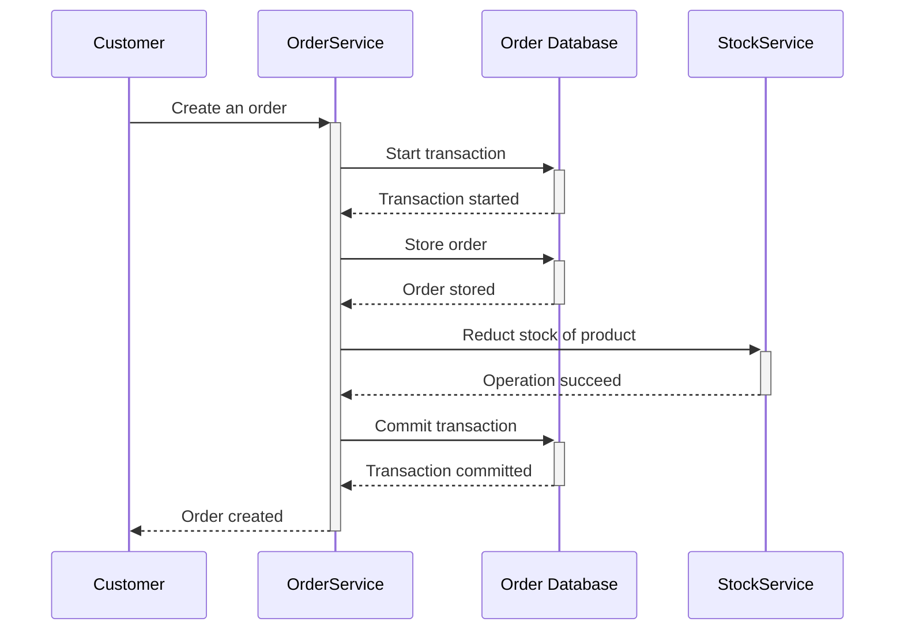
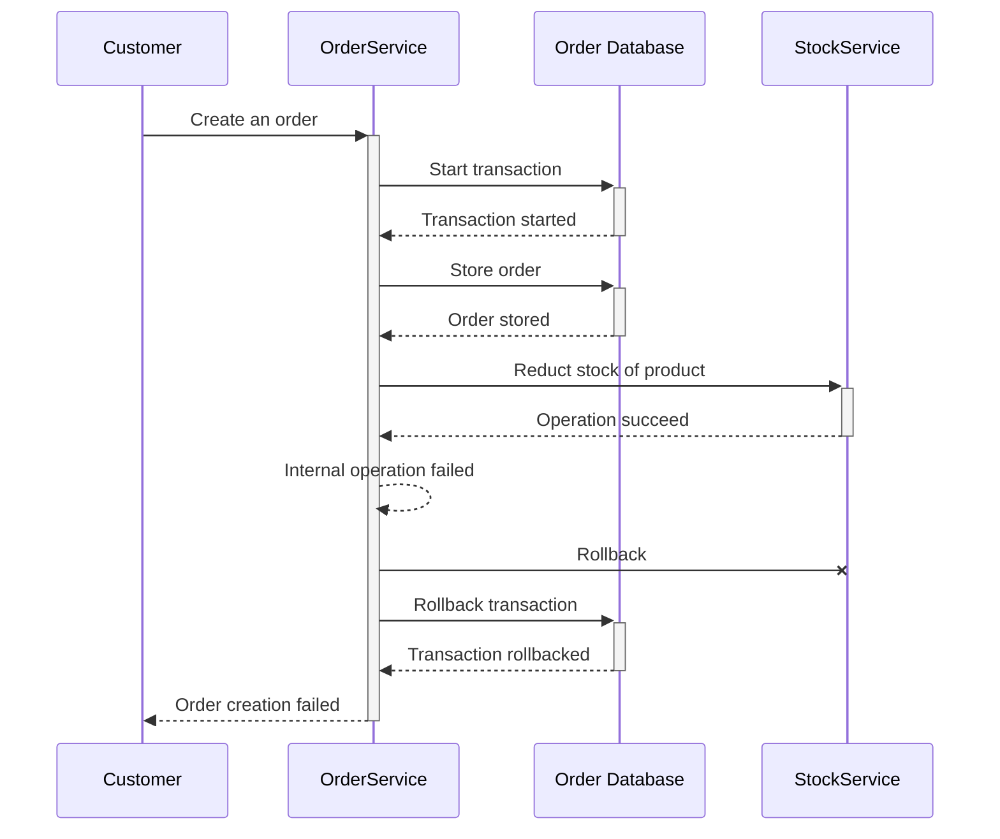
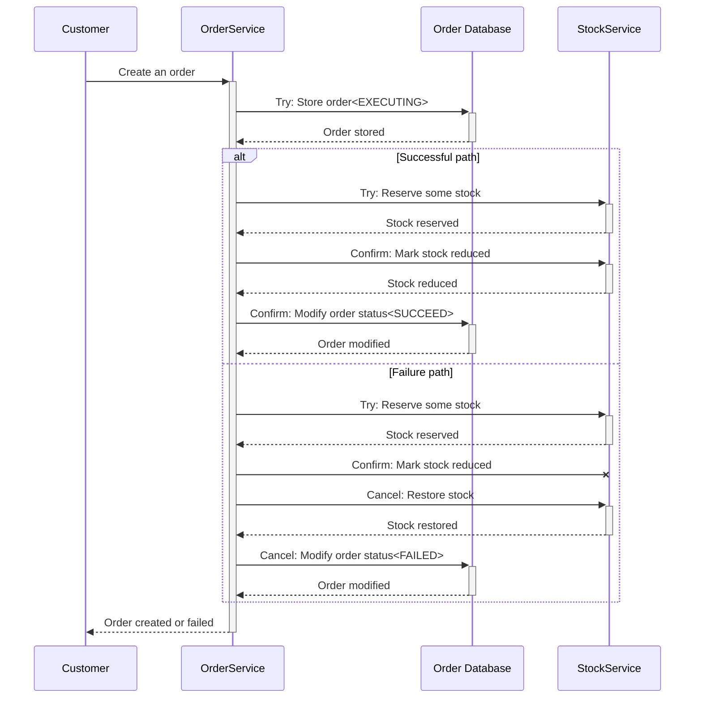

**分布式事务**是涉及两个或多个网络主机的[数据库事务](https://en.wikipedia.org/wiki/Database_transaction)。

众所周知，网络和主机可能由于某些原因而无法访问，例如电源故障、硬件故障等。

在这篇文章中，我将分享如何使用TCC实现分布式事务。
<!--more-->

## 问题

想象一下您正在开发一个电子商务应用程序。 通常，有很多服务，包括OrderService、StockService、ProductService。 如果客户购买某种产品并创建订单，我们需要创建订单并减少这些产品的库存。

下面的序列图显示，如果一切顺利，它将创建一个订单并确保 ACID。

如果数据库或下游服务出现故障，我们可以对数据库和 OrderService 进行简单的回滚，这看起来不错。 但是网络和主机可能无法访问，我们的回滚可能会丢失。 那么会发生什么呢？ 没有人知道，也许订单没有创建，库存却减少了，这是一件可怕的事情！

下面的序列图显示了事务回滚但库存减少，这导致不一致并破坏 ACID。

## 解决方案

TCC代表Try-Confirm-Cancel，分布式事务中的任何资源都应该提供三个阶段：

+ Try：尝试分配资源以供将来使用
+ Confirm：**Try**阶段所有操作均成功，提交分布式事务
+ Cancel：出了问题，回滚

以刚才的电商订单为例，下面的时序图展示了TCC中的整个流程。

如果一切顺利，我们的 Try-Confirm 将执行成功，数据库是一致的，如果失败，我们的 Try-Cancel 将处理这种情况，数据库也是一致的。 但正如上面提到的，网络和主机可能不可达，因此我们的提交或回滚将会丢失。

### 常见问题

下面是一些常见问题以及 TCC 的相关解决方案。

1. EXECUTING状态的订单创建失败: 本地事务会回滚
2. 调用StockService预留部分股票失败: 本地事务会回滚，并且回滚也会发送到StockService，StockService可以做回滚，也可以不做任何事情
3. 调用StockService预留部分股票成功，但StockService回复丢失：这会导致Try超时，本地事务会回滚，并且后续的回滚会发送到StockService，StockService可以进行回滚。

为了解决一些临时问题，我们可以重试。 重试时有两点需要考虑。

**幂等性**

幂等性是指无论发出多少次请求，结果都与第一个成功的请求相同。

比如我们想预留10个产品，无论调用StockService多少次，最终都只预留了10个。

对于每个订单，我们创建一个唯一的 id 作为幂等键，并将其发送到 StockService，因此如果 StockService 处理了当前请求，它将简单地返回之前的结果。

**延迟策略**

延迟策略有很多种：

+ 立即重试。 一旦上一个请求失败，立即重试，这不是一个好的选择，可能会导致下游服务过载
+ 固定重试率。 以固定速率（例如 10 毫秒）重试。
+ 增量重试。 每次重试都会依次增加延迟，例如sleep 10ms、20ms、30ms
+ 潜在的退避重试。 每次重试都会按指数增加延迟，例如睡眠10ms、20ms、40ms

### 特殊场景问题

由于网络问题，存在一些特殊问题。

**空回滚**

Try没有执行，但是Cancel执行了。

以下步骤显示了**空回滚**是如何发生的。

1. 向下游尝试（丢包）
2.事务回滚，向下游做Cancel
3. 下游接收取消

下游的取消操作会因为没有找到可取消的记录而失败，但如果我们向上游响应失败，上游会重试，这是一个无用的操作。 所以在空回滚的情况下，我们需要向上游响应成功，下游服务不做任何事情，以避免网络和计算资源的浪费。

**悬挂事务**

处理事务意味着因为网络问题，先执行Cancel再Try，如果处理不当，可能会导致不一致。

以下步骤显示了**悬挂事务**是如何发生的。

1. 尝试下行（网络拥塞）
2. Try超时导致事务回滚，向下游做Cancel
3. 下游收到Cancel，不做任何事情，只响应成功
4. 下游收到拥塞Try，预留资源

为了解决这个问题，下游服务需要在向上游回复 Cancel 调用之前记录当前事务已处理（通过记录 transactionId）。 收到Try后，检查当前事务是否已处理。

## 总结

TCC是实现分布式事务的一个很好的解决方案，但也存在一些问题。 幂等性和适当的重试使TCC变得更好。

## 参考

- [1] [分布式事务](https://en.wikipedia.org/wiki/Distributed_transaction)

