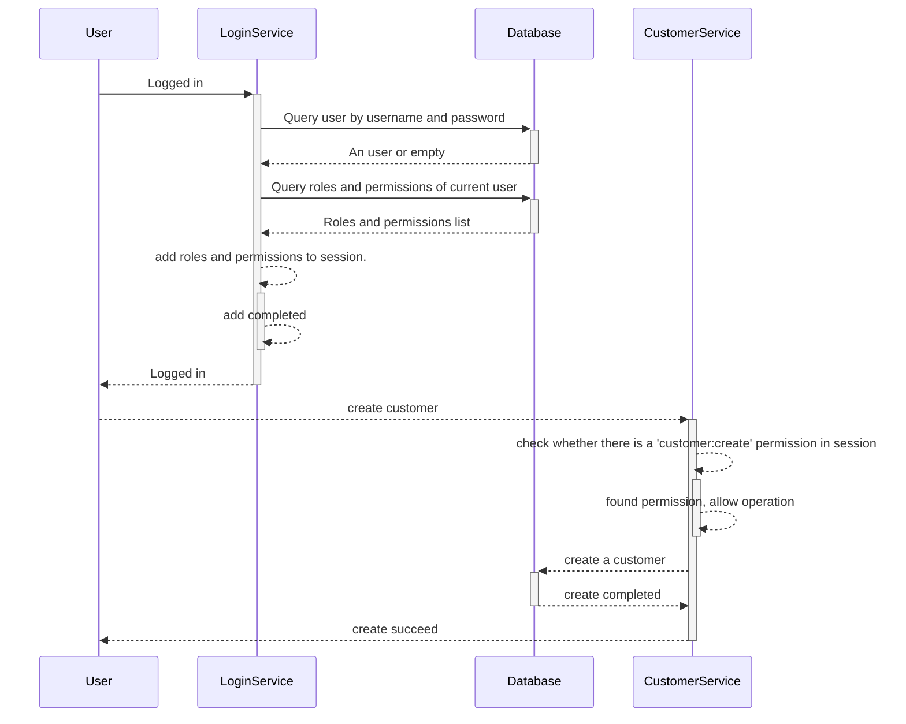

> [基于角色的访问控制（RBAC）](https://en.wikipedia.org/wiki/Role-based_access_control)是围绕**角色**和**权限**定义的策略中立的访问控制机制。RBAC 的组件（例如**角色权限**、**用户角色**和角色角色关系）使执行用户分配变得简单。

在本文中，我将分享一些有关 RBAC 和 ABAC 的信息。
<!--more-->
RBAC的基本思想是将权限管理与用户分离，降低管理复杂度，提供更高的灵活性和安全性。通过使用角色作为中间层，管理员可以更轻松地管理用户权限，而不必关注每个用户的权限设置。

## 术语

RBAC中有3个术语：

- 角色
- 权限
- 用户

**角色**

- 角色是一个抽象概念，定义一组相关的权限。例如，一个系统中有一些角色：管理员、普通用户、访客，每个角色都有相关的权限。
- 角色通过给用户分配权限，赋予用户相应的访问权限。
- 在某些实现中，角色可以形成层次结构以提供更高的灵活性。

**权限**

权限是执行特定操作或访问特定资源的能力。

- 权限描述了访问系统中的资源或操作的要求。
- 有两种定义权限的方法：允许和拒绝。允许权限允许用户访问资源或执行操作，就像白名单一样；拒绝权限拒绝用户访问资源或执行操作，就像黑名单一样。

**用户**

用户是系统中的一个身份，可以为其分配不同的角色以授予不同的权限。

## 实现

在系统中实现 RBAC 很简单。在接下来的内容中，我将提供一个简单的实现。

### 数据表定义

**roles**

表示系统存在的角色列表。

| 列名       | 柱型         | 描述         |
| ---------- | ------------ | ------------ |
| ID         | int          | 角色ID       |
| name       | varchar(40)  | 角色名称     |
| desc       | varchar(128) | 角色简要描述 |
| enabled    | boolean      | 角色是否启用 |
| created_at | Datetime     | 创建时间     |

**permissions**

表示系统存在的权限列表。

| 列名       | 柱型         | 描述           |
| ---------- | ------------ | -------------- |
| ID         | int          | 权限ID         |
| name       | varchar(40)  | 权限名称       |
| desc       | varchar(128) | 权限的简要说明 |
| created_at | datetime     | 创建时间       |

**role_permissions**

表示特定角色拥有哪些权限。

| 列名          | 柱型 | 描述   |
| ------------- | ---- | ------ |
| role_id       | 整数 | 角色ID |
| permission_id | 整数 | 权限ID |

**user**

用户代表有权登录本系统的身份。

| 列名       | 柱型         | 描述     |
| ---------- | ------------ | -------- |
| ID         | Int          | 用户ID   |
| username   | varchar(20)  | -        |
| password   | varchar(255) | 哈希密码 |
| name       | varchar(20)  | -        |
| created_at | datetime     | 创建时间 |

**user_roles**

表格表示特定用户具有的角色。

| 列名    | 柱型 | 描述   |
| ------- | ---- | ------ |
| user_id | int  | 用户ID |
| role_id | Int  | 角色ID |

### 示例数据

如下是一个CRM的RBAC数据示例。

**用户表**

| id   | username | password | name     | created_at          |
| ---- | -------- | -------- | -------- | ------------------- |
| 1    | staff1   | -        | staff1   | 2023-01-01 10:00:00 |
| 2    | manager1 | -        | manager1 | 2023-01-01 10:00:00 |

**角色表**

| id   | name     | description | enabled | created_at          |
| ---- | -------- | ----------- | ------- | ------------------- |
| 1    | salesman | -           | true    | 2023-01-01 10:00:00 |
| 2    | manager  | -           | true    | 2023-01-01 10:00:00 |

**权限表**

| id   | name            | description | created_at          |
| ---- | --------------- | ----------- | ------------------- |
| 1    | customer:create | -           | 2023-01-01 10:00:00 |
| 2    | customer:update | -           | 2023-01-01 10:00:00 |
| 3    | customer:delete | -           | 2023-01-01 10:00:00 |
| 4    | customer:view   | -           | 2023-01-01 10:00:00 |

**角色-权限关联表**

The following data shows the salesman allows create/update/view a customer and the manager has the full access.

| role_id | permission_id |
| ------- | ------------- |
| 1       | 1             |
| 1       | 2             |
| 1       | 4             |
| 2       | 1             |
| 2       | 2             |
| 2       | 3             |
| 2       | 4             |

**用户角色表**

| user_id | role_id |
| ------- | ------- |
| 1       | 1       |
| 2       | 2       |

### 时序图

下图显示了用户登录并创建客户的示例。

## 结论

基于角色的访问控制（RBAC）在访问控制领域具有重要的应用价值。RBAC通过将权限与角色关联起来，实现了结构化的访问控制管理方法。RBAC的实施可以提高管理效率，增强系统安全性。

## 参考

- [基于角色的访问控制](https://en.wikipedia.org/wiki/Role-based_access_control)