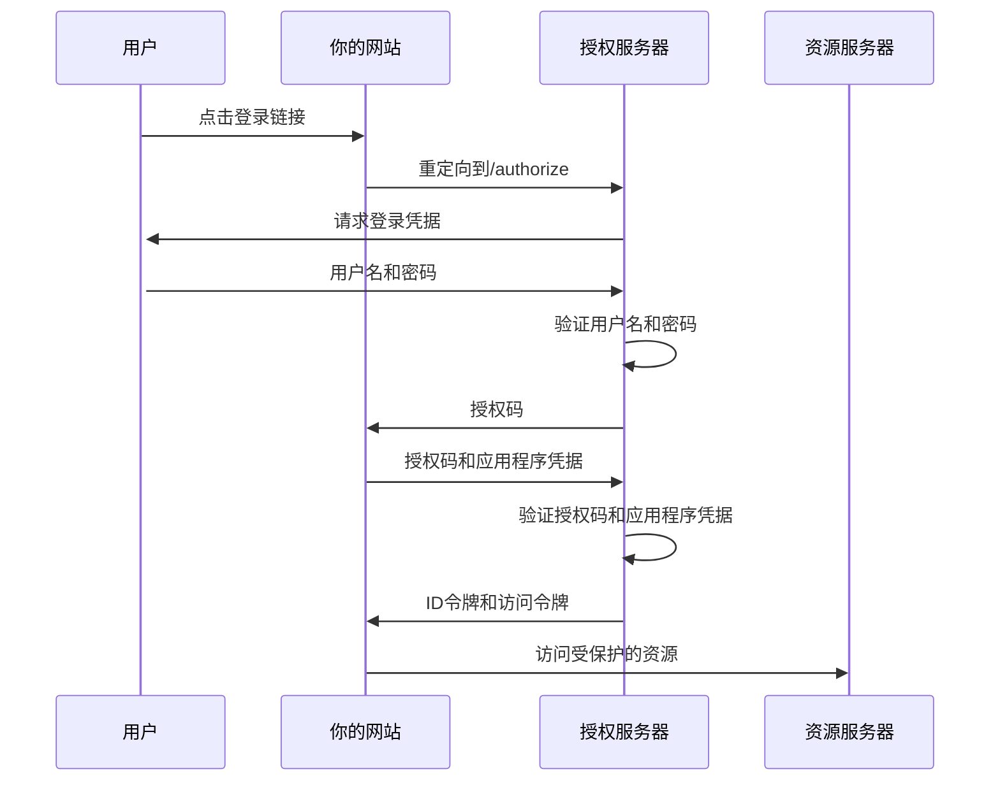
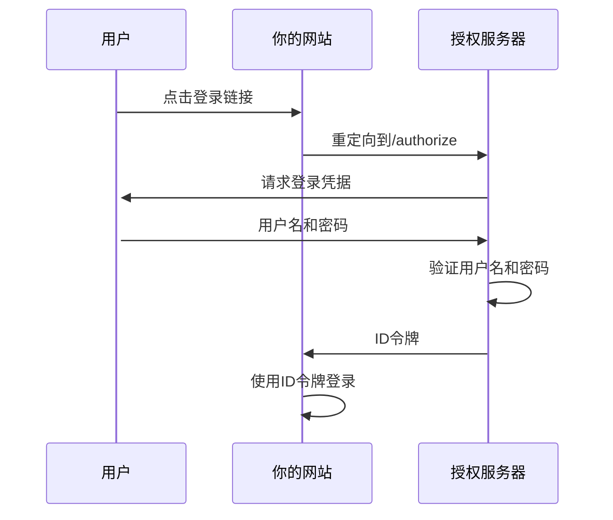
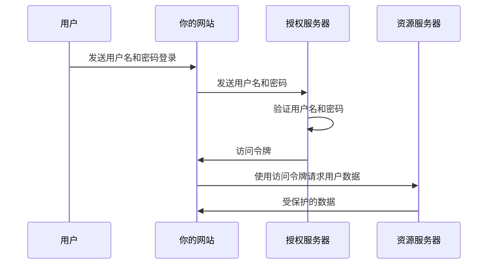
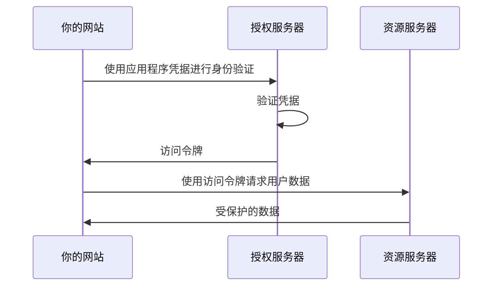

OAuth是一种授权方法，它简化了应用程序的授权流程。许多人可能已经了解了授权码流程，但还有其他方法。在本文中，我们将学习它是如何工作的，涵盖授权类型、原理和注意事项。

<!--more-->

OAuth 2.0授权框架作为一种协议运行，使用户能够授予第三方网站或移动应用程序访问其受保护的资源。这是在不需要披露他们的长期凭据或在某些情况下他们的身份的情况下实现的。

## 角色

在OAuth 2.0框架中有许多角色，让我们来看一下：

+ **资源所有者**：拥有资源并有能力授予对受保护资源的访问权限的实体，例如最终用户。
+ **资源服务器**：维护受保护资源的服务器。必须与此服务器交互才能获得对受保护资源的访问权限。
+ **客户端**：代表资源所有者寻求访问受保护资源的应用程序。
+ **授权服务器**：负责对资源所有者进行身份验证并发放访问令牌的服务器，以响应有效的授权。

例如，想象一下，我想创建一个与Google OAuth交互的Web应用程序来访问用户的昵称、头像和电子邮件。以下是角色的定义：

+ **资源所有者**：使用Google服务的个人。
+ **资源服务器**：Google的服务器，保存有用户的个人信息，如昵称、头像和电子邮件。
+ **客户端**：我的Web应用程序，设计为将用户重定向到Google OAuth以获取访问令牌。
+ **授权服务器**：Google的OAuth服务器，负责安全存储和验证用户的登录凭据。

## 授权类型

OAuth 2.0定义了四种获取访问令牌的流程，这些流程被称为授权类型。

### 授权码流程

授权码流程涉及将授权码交换为访问令牌。这是一种非常常见的流程，因为许多移动应用程序和网站需要授权用户。

通常，你需要从授权服务器申请appid和secret，并且你需要设置回调URL。在授权服务器生成授权码之后，它将使用授权码重定向到你的回调URL。

1. 用户点击“使用你的网站或应用程序登录”。
2. 你的网站使用`authorization_code`作为`response_type`将用户重定向到授权服务器以进行授权。
3. 授权服务器将要求用户登录。
4. 用户向授权服务器提供他/她的用户名和密码进行登录。
5. 授权服务器检查用户名和密码是否正确。
6. 如果用户名和密码正确，授权服务器将生成一个随机的授权码，然后使用该码重定向到你的回调URL。
7. 你的网站使用appid、secret和授权码请求授权服务器交换用户的ID令牌和访问令牌。
8. 授权服务器将检查你的代码、appid和secret；如果它们正确，它将返回用户的ID令牌和访问令牌给你的网站。
9. 你的网站可以使用此ID令牌和访问令牌访问资源服务器上的受保护资源。

**一些注意事项**

1. 你应该在高度安全的环境中存储你的appid和secret；否则，你的用户数据可能会被未经授权的攻击者访问。
2. 在重定向到授权服务器之前，你应该在应用程序中设置基于会话的随机状态。授权服务器将在生成授权码后将此参数传递给你的网站。你可以检查此参数以防止跨站请求伪造（CSRF）攻击。

### 隐式表单Post

如果你想做的只是实现登录，并且你不需要获取访问令牌来调用API，你可以选择隐式表单Post。这种方法不需要使用secret来交换访问令牌，因此它可以被仅限前端使用，安全有效。

1. 用户点击“登录”。
2. 你的网站将`response_type`设置为`id_token`并将用户重定向到授权服务器。
3. 用户向授权服务器提供他/她的用户名和密码进行登录。
4. 授权服务器检查用户名和密码是否正确。
5. 如果用户名和密码正确，授权服务器将生成一个随机的ID令牌，然后使用该令牌重定向到你的回调URL。
6. 你的网站的JavaScript从URL的哈希部分提取令牌，并向你的服务器发送HTTP POST请求。
7. 你的服务器允许用户登录。

**一些注意事项**

1. 由于ID令牌暴露给客户端，这可能是一个带有客户端JavaScript的网页。如果页面没有得到适当的保护，这使得令牌容易受到XSS攻击。
2. 这种方法可能容易受到跨站请求伪造（CSRF）攻击，因为令牌通过重定向或表单帖子传输，如果用户从另一个浏览器标签页登录到目标服务，恶意网站可以触发这些请求。

### 资源所有者密码流程

当基于重定向的流程（如授权码流程和隐式表单Post）存在无法重定向限制时，有一种新的类型，资源所有者密码流程。

> 在此流程中，凭据（如用户名和密码）被发送到后端服务器，然后后端服务器将凭据发送到授权服务器以获取访问令牌，因此必须绝对信任应用程序处理此信息。

1. 用户输入他们的用户名和密码，然后点击“登录”。
2. 你的网站将用户名和密码发送到授权服务器。
3. 授权服务器验证用户名和密码。
4. 授权服务器回复访问令牌或错误消息。
5. 你的网站获得访问令牌，并使用该访问令牌从资源服务器请求用户数据。
6. 资源服务器回复受保护的数据。

**一些注意事项**

由于你的网站可以访问凭据，并且可以在交换访问令牌之前存储凭据以备将来使用，你需要确保你的网站绝对可信。

### 客户端凭据流程

客户端凭据流程涉及应用程序交换其应用程序凭据，如appid和secret，以获取访问令牌。这种流程是一种机对机的方法，没有用户参与。

1. 你的网站使用应用程序凭据向授权服务器发送请求。
2. 授权服务器验证凭据。
3. 如果凭据正确，授权服务器将回复访问令牌。
4. 你的网站获得访问令牌，并使用该访问令牌向资源服务器请求用户数据。
5. 资源服务器回复受保护的数据。

**一些注意事项**

1. 你应该在一个安全的环境中保管你的appid和secret，并使用HTTPS与其他服务器通信。

## 结论

随着我们对Oauth2.0框架的全面概述以及介绍4种不同的工作流程的结束。

Oauth极大地简化了我们应用程序的授权过程，但是，权力越大，责任越大。OAuth实现的安全性在很大程度上依赖于开发人员对其协议和最佳实践的理解，选择适合每种场景的授权类型，实施严格的传输安全措施，并确保所有令牌都得到最大程度的谨慎处理，以防止未经授权的访问是至关重要的。

总结来说，OAuth 2.0是开发人员工具箱中的强大工具，促进了我们相互连接的数字世界中安全和用户友好的资源共享。通过应用本文概述的原则和协议，我们可以帮助确保OAuth在未来几年继续作为授权和身份管理的可靠基础。
