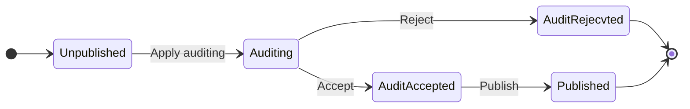

This is the first article written in English. In this article, I'll share how to build a Finite State Machine(FSM) to help business workflow transition, such as auditing.

> A **finite-state machine** (**FSM**) or **finite-state automaton** (**FSA**, plural: *automata*), **finite automaton**, or simply a **state machine**, is a mathematical [model of computation](https://en.wikipedia.org/wiki/Model_of_computation). It is an [abstract machine](https://en.wikipedia.org/wiki/Abstract_machine) that can be in exactly one of a finite number of *[states](https://en.wikipedia.org/wiki/State_(computer_science))* at any given time. The FSM can change from one state to another in response to some [inputs](https://en.wikipedia.org/wiki/Input_(computer_science)); the change from one state to another is called a *transition*
>
> ***Wikipedia*** - **[Finite-state machine](https://en.wikipedia.org/wiki/Finite-state_machine)**

<!--more-->

## Situation

Imaging you are working at a E-Commercial company, if you want to publish a new product to production environment, you need to submit a **AuditRequest** first, then your manager will accept or reject this AuditRequest. If your manager accept, you can publish your product, so anyone can see it.

In this case, the state of the product transited many times, show as the following graph.

## Definition of Terms
