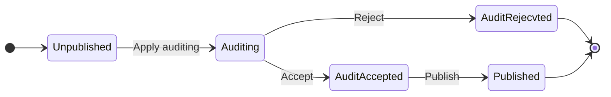

This is the first article written in English. In this article, I'll share how to build a Finite State Machine(FSM) to help business workflow transition, such as auditing.

> A **finite-state machine** (**FSM**) or **finite-state automaton** (**FSA**, plural: *automata*), **finite automaton**, or simply a **state machine**, is a mathematical [model of computation](https://en.wikipedia.org/wiki/Model_of_computation). It is an [abstract machine](https://en.wikipedia.org/wiki/Abstract_machine) that can be in exactly one of a finite number of *[states](https://en.wikipedia.org/wiki/State_(computer_science))* at any given time. The FSM can change from one state to another in response to some [inputs](https://en.wikipedia.org/wiki/Input_(computer_science)); the change from one state to another is called a *transition*
>
> ***Wikipedia*** - **[Finite-state machine](https://en.wikipedia.org/wiki/Finite-state_machine)**

<!--more-->

## Situation

Imaging you are working at a E-Commercial company, if you want to publish a new product to production environment, you need to submit a **AuditRequest** first, then your manager will accept or reject this AuditRequest. If your manager accept, you can publish your product, so anyone can see it.

In this case, the state of the product transited many times, show as the following graph.




## Definition of Terms

+ FromState: the current state of an entity. In the example above, at the beginning, the state is **Unpublished**.
+ Event: the event to transit to next state. There is an **Apply auditing** event triggered by you.
+ ToState: the next state.  There is an **Auditing** state.
+ Action: action to execute. This action will change the state of the product from **FromState** and **ToState**, and action allows to do more things such as sending a HTTP request to an audit platform.
+ Transition: A record represents from **FromState** to **ToState** through **Event** with **Action**.

## Implementing

How to implement this FSM? Essentially, we can think of it as a directed cyclic graph, each Node is a state, each edge is a event. So we can use some data structure and algorithm of graph to implement this. 

The following are the implementation steps:

1. Config the state machine, usually we can query the all the transitions from database, so we can config it freely.
2. Make a `Map<FromState, Map<Event, Pair<ToState, List<Action>>>>` map, it represents the graph.
3. Query current state of product and event, we can get event name from **requestURI**.
4. Find the next `Pair` in Map, by current state and event.

The following is the implementation of the java language.

```java
	// Action.java
package org.example;

import java.util.List;

@FunctionalInterface
public interface Action {
    void run();
}

// ApplyAuditAction.java
package org.example.actions;

import org.example.Action;

// send http request to apply an audit
public class ApplyAuditAction implements Action {
    @Override
    public void run() {
        System.out.println("mock send HTTP request");
    }
}

// AuditController.java
package org.example;

public class AuditController {
    Repository repository;

    public String apply(int productId) {
        try {
            var product = repository.findProduct(productId);
            var transitions = repository.findAllByTypeId(product.typeId);
            var stateMachine = new StateMachine(transitions);
            stateMachine.transit(product, Event.ApplyAudit);
            return "succeed";
        } catch (RuntimeException e) {
            return e.getMessage();
        }
    }
}

// Event.java
package org.example;

enum Event {
        ApplyAudit,
        AcceptAudit,
        RejectAudit,
        Publish
}

// Pair.java
package org.example;

public class Pair<F, S> {
    public F first;
    public S second;

    public Pair(F first, S second) {
        this.first = first;
        this.second = second;
    }
}

// Product.java
package org.example;

public class Product {
    public int id;
    public State state;

    public int typeId;
}

// Repository.java
package org.example;


import java.util.List;

// a simple definition of Repository, you need to implement
public interface Repository {
    List<Transition> findAllByTypeId(int typeId);

    Product findProduct(int productId);
}
// State.java
package org.example;

enum State {
    Unpublished,
    Auditing,
    AuditAccepted,
    AuditRejected,
    Published
}
// StateMachine.java
package org.example;

import org.example.actions.ApplyAuditAction;

import java.util.Arrays;
import java.util.HashMap;
import java.util.List;
import java.util.Map;

public class StateMachine {
    private static final Map<String, Action> actionMap = new HashMap<>() {{
        put("applyAudit", new ApplyAuditAction());
    }};
    private final Map<State, Map<Event, Pair<State, List<Action>>>> graph;

    public StateMachine(List<Transition> transitions) {
        graph = new HashMap<>();
        for (var transition : transitions) {
            addTransition(transition);
        }
    }

    private void addTransition(Transition transition) {
        graph.putIfAbsent(transition.fromState, new HashMap<>());
        graph.get(transition.fromState).put(transition.event, new Pair<>(transition.toState, makeActions(transition.actions)));
    }

    private List<Action> makeActions(String action) {
        var actionNames = action.split(","); // use comma to split multi actions
        return Arrays.stream(actionNames).map(actionMap::get).toList();
    }

    public void transit(Product product, Event event) {
        if (!graph.containsKey(product.state)) {
            throw new RuntimeException("Product state not found");
        }
        if (!graph.get(product.state).containsKey(event)) {
            throw new RuntimeException("Event not found");
        }
        var next = graph.get(product.state).get(event);
        // modify product state
        product.state = next.first;
        // execute actions
        for (var action : next.second) {
            action.run();
        }
    }
}

// Transition.java
package org.example;

public class Transition {
    public int id;
    public int typeId; // represents the type of a product
    public State fromState;
    public Event event;
    public State toState;
    public String actions;
}
```

## Conclusion

By using a configurable FSM, you can easily modify the workflow by modifying database record, no code editing.

## Reference

1. ***Wikipedia*** - **[Finite-state machine](https://en.wikipedia.org/wiki/Finite-state_machine)**
